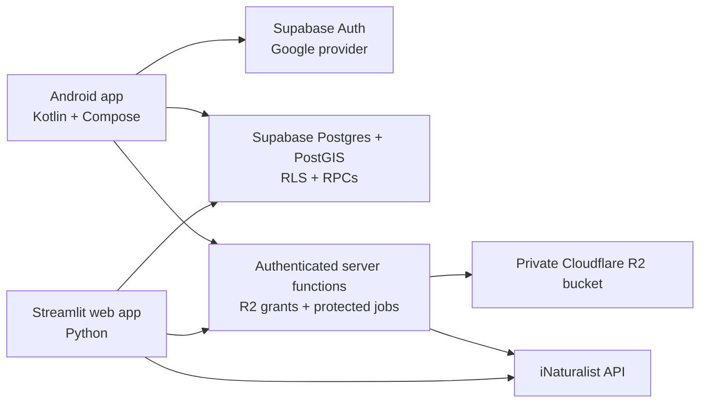

# HikeJournal Android Companion Plan

## Decision

Build a real Android app in Kotlin with Jetpack Compose while keeping the
Streamlit application as the web and desktop experience.

Both clients should use the existing Supabase Postgres database and Cloudflare
R2 bucket. Do not embed the Supabase secret/service key or R2 credentials in the
Android app. Android will use Supabase Auth and a publishable key for normal
database access, Row Level Security for authorization, and short-lived upload
and download grants for R2.

The first Android release is a field companion, not a screen-for-screen port:

1. Sign in.
2. Browse the library and individual journals.
3. Create and edit a hike.
4. Add quick sightings or upload several photos to a hike.
5. Edit photo notes and captions.
6. Keep uploads safe through weak or missing connectivity.

Species review, batch identification, and iNaturalist publishing stay in the
Streamlit app initially. They can move to Android after the shared backend owns
their secrets and long-running operations.

## Why this direction

- Kotlin and Compose provide the native Android experience requested without
  introducing an iOS abstraction that HikeJournal does not currently need.
- Streamlit remains valuable as the large-screen archive, review, and admin
  workspace. It does not need to be retired or wrapped in a WebView.
- Supabase Postgres and PostGIS already model the important product data and map
  queries. Replacing them would add migration risk without solving a current
  problem.
- R2 already works in the server-hosted app and is a good home for the photo
  library. The access path needs to change for an untrusted mobile client, not
  the storage provider.
- A local upload queue is part of the first useful mobile product. A hiking app
  cannot assume a stable connection.

## What exists today

The current repository already has useful seams to build on:

- `hike_journal/application.py` coordinates the Streamlit surfaces.
- `hike_journal/services/repositories.py` contains most database operations.
- `hike_journal/services/storage.py` abstracts Supabase Storage and R2.
- `hike_journal/services/image_processing.py` normalizes and compresses photos.
- `hike_journal/services/inat.py` isolates the iNaturalist API.
- Supabase stores hikes, photos, collaborators, route imports, locations, and
  species observations.
- R2 support uploads objects directly from the trusted Streamlit server and
  saves a permanent public URL with the photo row.
- Streamlit authenticates with Google OIDC and applies ownership checks in the
  Python application.

Two current choices are not safe to copy into Android:

1. The database policies in `sql/schema.sql` currently allow all operations
   with `using (true)` and `with check (true)`. They are placeholders for the
   trusted/single-user web deployment, not mobile authorization.
2. R2 access keys are server secrets. Shipping them in an APK would expose the
   entire bucket. Permanent public image URLs also weaken the privacy promise of
   a private journal.

## Target architecture



The Android app may talk directly to Supabase for ordinary authorized reads and
writes. Operations that require a secret, span several systems, or need strict
transactional behavior go through authenticated server functions.

For the first release those functions are:

- `create-photo-upload`: verify the user can add to the target hike, reserve a
  photo ID/object key, and return a short-lived R2 `PUT` URL.
- `complete-photo-upload`: verify the object, record dimensions/EXIF/file size,
  and move the photo from `uploading` to `ready`.
- `delete-photo`: authorize once, delete R2 derivatives, and delete or tombstone
  the database record.
- `image-url`: return a short-lived read URL, or authorize an image proxy request.

Use Supabase Edge Functions first because they receive the user's Supabase JWT
and fit beside the current database. If image transformation or R2 traffic later
fits Cloudflare Workers better, the same HTTP contract can move without changing
the Android repositories.

## Identity and authorization migration

The web app currently knows a Google `sub` and email. Supabase Auth gives Android
an `auth.uid()`. Introduce a stable application identity so both can refer to the
same person during coexistence.

### New identity model

Add an `app_users` table with:

- `id`: stable HikeJournal user UUID.
- `supabase_user_id`: nullable unique reference to `auth.users.id`.
- `google_subject`: nullable unique Google OIDC subject used by Streamlit.
- `email`: normalized, verified email for migration and invitations.
- display fields and timestamps.

Add `owner_user_id` to hikes and standalone photos. Replace the collaborator-only
email model over time with `hike_memberships(hike_id, user_id, role)`. Keep pending
email invitations separately so an email address is not treated as permanent
identity.

On the first Supabase Auth login, link the account to the existing `app_users`
row using the verified Google identity/email, then backfill `owner_user_id` for
the current records. The migration must produce an audit report before it changes
any ownership.

### RLS rules

Replace open policies with explicit rules:

- A user can read a hike when they own it or have a membership.
- Only owners/editors can update a hike or add/edit its photos and observations.
- Only an owner can archive/delete a hike or manage memberships.
- Standalone photos are visible and editable only by their owner.
- Route imports and map RPCs must check the same visible-hike predicate.
- Location reference data can be authenticated-read-only; admin writes stay
  server-side.
- Anonymous users receive no journal rows.

Keep the Streamlit database secret only on its host. Its repositories must accept
the resolved `app_user_id` and apply it in every read/write path even though the
server credential can bypass RLS. This preserves the current OIDC login while the
web app remains a trusted backend client.

## Photo and R2 contract

Stop treating `public_url` as the durable identity of a photo. The durable values
are the bucket and object keys.

Recommended photo fields:

- `id` generated before upload.
- `storage_key` for the display image.
- `thumbnail_key` for the small derivative.
- optional `original_key` only if retaining originals becomes a product choice.
- `upload_status`: `pending`, `uploading`, `ready`, `failed`, or `deleted`.
- `content_hash` and `client_mutation_id` for retry/deduplication.
- `width`, `height`, `file_size`, `content_type`, and sanitized EXIF.
- `created_at` and `updated_at`.

Use a user-scoped path such as:

`users/{app_user_id}/hikes/{hike_id}/photos/{photo_id}/display.jpg`

Android processing should match the existing web contract initially: normalize
orientation, retain the location and capture time needed by the journal, produce
the bounded display JPEG, and produce a thumbnail. Put this logic behind test
fixtures so Python and Kotlin produce equivalent metadata rather than attempting
to share implementation code.

Uploads are a two-phase operation:

1. Create the local draft and database reservation with stable IDs.
2. Obtain a short-lived upload URL and upload directly to R2.
3. Finalize the row only after object verification succeeds.
4. Retry idempotently after process death or connectivity loss.

Make the R2 bucket private before private image delivery is considered complete.
Signed URLs are bearer tokens, so keep their lifetime short and cache the actual
image bytes on-device rather than persisting signed URLs as data.

## Android application shape

Create an `android/` project beside the Python app. Do not mix Android code into
the existing Python package.

Suggested modules/packages for the initial size:

```text
android/app
  auth
  data/local
  data/remote
  data/repository
  domain/model
  feature/library
  feature/journal
  feature/upload
  feature/photo
  feature/settings
  sync
  ui/theme
```

Use:

- Jetpack Compose and Material 3, with a HikeJournal-specific visual system.
- Navigation Compose.
- ViewModels with coroutines and `Flow`.
- Room as the on-device source of truth for cached journals, drafts, and the
  mutation/upload queue.
- WorkManager for network-constrained uploads and retries.
- Android Photo Picker for single and multi-photo selection.
- Coil for authenticated image loading and disk caching.
- Supabase Kotlin Auth/PostgREST/Functions clients.
- MapLibre Native for map continuity with the current MapLibre web surface,
  introduced after the journal/upload vertical slice.

Do not add a general dependency-injection framework until the object graph makes
it worthwhile. Constructor injection and a small application container are
enough for the first vertical slice.

## Sync rules

Mobile should be offline-capable for capture and recently viewed content, not a
full collaborative offline database in version one.

- All new client-created entities use UUIDs created on-device.
- The local Room database is what the UI reads.
- Network refreshes merge server changes into Room.
- Pending writes carry a unique mutation ID and retry safely.
- Photo uploads use unique WorkManager jobs and exponential backoff.
- Caption/note edits can be last-write-wins initially, using `updated_at` and a
  visible conflict message if the server changed after the local edit began.
- Deletes are tombstoned until both database and R2 cleanup finish.
- Realtime is optional. Start with refresh-on-open, pull-to-refresh, and refresh
  after writes; add Realtime only if two-client freshness is noticeably poor.

## Delivery phases

### Phase 0 — Shared-backend safety

Deliverables:

- Versioned Supabase migrations for `app_users`, ownership, memberships, upload
  state, storage keys, timestamps, and RLS.
- Backfill and rollback scripts with row counts and ownership audit output.
- Supabase Google Auth configured for Android without changing the current web
  login.
- Authenticated upload/finalize/delete/read function contracts.
- A small contract test suite that proves owner, collaborator, and unrelated-user
  behavior.
- Streamlit repository queries changed from fetch-all-then-filter to explicit
  user-scoped reads where practical.

Exit gate:

- An authenticated test user can only read and mutate permitted records with a
  publishable key, and no mobile-visible credential can list or delete arbitrary
  R2 objects.

### Phase 1 — Walking skeleton

Deliverables:

- Android project, HikeJournal theme, navigation, Google sign-in, session restore,
  and sign-out.
- Read-only Library and Journal screens backed by the real Supabase project.
- Image loading from the protected R2 read path.
- A small automated UI smoke test and repository integration tests.

Exit gate:

- Creating or editing a test hike on Streamlit appears on Android after refresh,
  and an unauthorized account cannot see it.

### Phase 2 — Field capture beta

Deliverables:

- Create/edit hike and quick-sighting flows.
- Android Photo Picker with multi-select.
- Local metadata extraction, orientation correction, image optimization, and
  thumbnail generation.
- Room-backed draft/upload queue with foreground progress, cancellation, retry,
  and process-death recovery through WorkManager.
- Caption/note editing and photo deletion.
- Clear per-photo states: waiting, uploading, uploaded, and needs attention.

Exit gate:

- Select several photos in airplane mode, close the app, reconnect, and see each
  photo uploaded exactly once and appear correctly in Streamlit with its time,
  coordinates, dimensions, and caption.

This is the first release worth installing for daily use.

### Phase 3 — Native browsing

Deliverables:

- Polished archive search/filtering, hike covers, archive state, and standalone
  sightings.
- Full-screen photo viewer and encounter navigation.
- Read-only Species Log with species-focused encounters.
- MapLibre map with viewport RPCs and hike routes.
- Adaptive phone/tablet layouts, accessibility, and performance passes.

Exit gate:

- The main browse loop—Library to Journal/Species to photo to Map—feels complete
  without opening the web app.

### Phase 4 — Review and iNaturalist

Move the iNaturalist token and OAuth attempt state out of `.runtime` files into a
server-side, per-user encrypted store before exposing these workflows to Android.

Deliverables:

- Server-owned iNaturalist OAuth callback and token refresh/storage.
- Protected species suggestion, taxon enrichment, publish, photo attach, and sync
  operations.
- Durable job status for rate-limited or long-running work.
- Native review queue, candidate selection, confirm/reject, and publishing status.

Exit gate:

- A publish retry cannot create duplicate iNaturalist observations, and Android
  and Streamlit show the same review/publishing state.

### Phase 5 — Production hardening

Deliverables:

- Internal Play testing, crash reporting, structured server logs, privacy policy,
  data export/delete path, backup/restore drill, and secret rotation drill.
- Network, battery, large-library, accessibility, and older-device testing.
- Metrics limited to useful operational signals; do not collect location or
  journal content for analytics.

Exit gate:

- A beta can recover from failed uploads and partial deletes without manual
  database repair, and restoring the database plus R2 reproduces the journal.

## Suggested release boundaries

### Companion beta

Phases 0–2. This gives HikeJournal the most valuable native behavior quickly:
reliable field capture and access to the same journal as Streamlit.

### Browse-complete Android app

Add Phase 3. At this point Android is the preferred phone experience while
Streamlit remains the best large-screen management experience.

### Near feature parity

Add Phase 4. Do this only after real usage shows that review and publishing are
important on a phone; they are the most complex and secret-sensitive workflows.

For one developer already familiar with this codebase, a reasonable planning
range is roughly 5–8 focused weeks for the companion beta and another 5–9 weeks
for polished browsing plus review/publishing. Treat those as scope ranges, not
calendar promises; auth migration, private image delivery, and offline upload
recovery are the risk-bearing items.

## What not to do

- Do not wrap Streamlit in a WebView and call it native.
- Do not rewrite or shut down Streamlit before the Android companion proves its
  value.
- Do not place a Supabase secret/service key, R2 key, Google client secret, or
  iNaturalist secret in the APK.
- Do not leave the current open RLS policies in place when distributing a mobile
  build.
- Do not make permanent signed URLs part of the photo rows.
- Do not start with every existing review, map, admin, and publishing surface.
- Do not introduce Realtime or a general microservice layer until a concrete sync
  or server-operation need appears.

## First implementation milestone

Before building polished screens, complete one end-to-end vertical slice on a
development Supabase project:

1. Sign into Android with Google.
2. Read only the signed-in user's hikes through RLS.
3. Create a hike with a client-generated UUID.
4. Select one photo.
5. Queue and upload it to R2 through a short-lived grant.
6. Finalize the photo row.
7. See the new hike and photo in the unchanged Streamlit app.
8. Edit the caption in Streamlit and refresh it into Android.

If this slice works under airplane-mode interruption and a second unauthorized
account cannot access it, the architecture is sound enough to scale into the
rest of the plan.

## Official references

- [Android architecture recommendations](https://developer.android.com/topic/architecture/recommendations)
- [Android offline-first data guidance](https://developer.android.com/topic/architecture/data-layer/offline-first)
- [Android Photo Picker](https://developer.android.com/training/data-storage/shared/photo-picker)
- [Supabase Kotlin quickstart](https://supabase.com/docs/guides/getting-started/quickstarts/kotlin)
- [Supabase Row Level Security](https://supabase.com/docs/guides/database/postgres/row-level-security)
- [Supabase Edge Function authentication](https://supabase.com/docs/guides/functions/auth)
- [Cloudflare R2 presigned URLs](https://developers.cloudflare.com/r2/api/s3/presigned-urls/)
- [Streamlit OIDC authentication](https://docs.streamlit.io/develop/concepts/connections/authentication)
